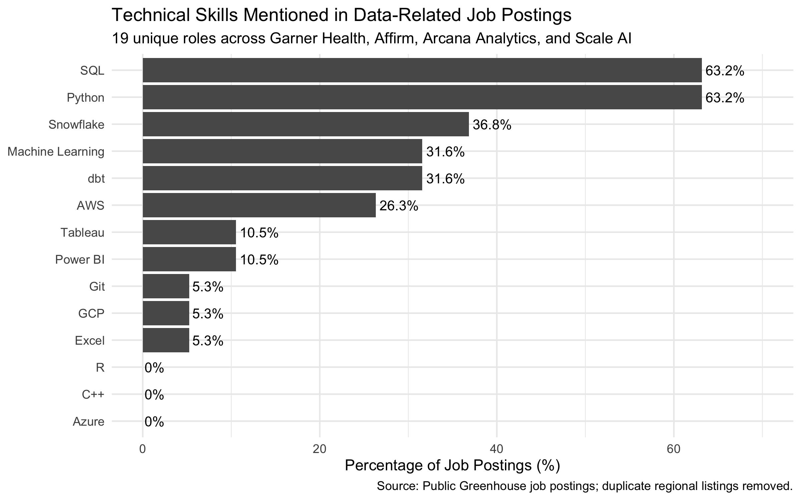

## What Skills Matter Most for Data-Related Jobs?

For students preparing for a career in the data field, deciding which technical skills to prioritise is often a difficult question. Recruitment announcement often list a variety of programming languages, data tools, cloud platforms and analysis methods. This raises a practical question: **which technical skills appear most frequently in the recruitment announcement of data-related positions?**

To explore this problem, I used the `rvest` package in R to scrape public recruitment information from the Greenhouse recruitment pages of four companies, Garner Health, Affirm, Arcana Analytics and Scale AI. I the analyzed the job descriptions of data-related positions to identify the frequency of various technical skills mentioned.                                          

## Collecting the Job Postings

I collected job postings from the public Greenhouse career pages of Garner Health, Affirm, Arcana Analytics, and Scale AI. These pages can be accessed publicly without logging in or bypassing any access restrictions.

Using `rvest`, I identified relevant postings from each company's job board and then extracted the main text from each individual job page. The function below illustrates the core scraping process:
```{r}
library(rvest)

get_description <- function(url) {
  Sys.sleep(1)

  read_html(url) %>%
    html_elements("main") %>%
    html_text2()
}
```

Because each career page contained many positions unrelated to the analysis, I filtered the listings and focused on data-related roles, such as Data Analyst, Data Engineer, Data Scientist, Quantitative Analyst, and Machine Learning positions.

The initial scraping process produced **21 job postings** across the four companies.

## Cleaning the Data

The initial scraping process selected 21 job postings. However, some positions are repeatedly released for different regions; for example, Affirm has released recruitment information for the United States and Canada for the same functional position. To avoid the impact of duplicate positions on the weight of results, these duplicates are eliminated in this post. The final dataset covers a total of **19 unique data-related positions** in these four companies. I then searched each job description for mentions of technical skills such as SQL, Python, Snowflake, dbt, AWS, Tableau, Power BI, Git, and machine learning.

## Which Skills Appeared Most Often?

The results show a clear pattern in this sample. SQL and Python were the most frequently mentioned skills, each appearing in 12 of the 19 unique job postings (63.2%). Snowflake appeared in 36.8% of postings, while dbt and machine learning were each mentioned in 31.6%. AWS appeared in 26.3% of the postings.

The figure below summarizes the frequency with which each technical skill appeared in the collected job descriptions.


## What Should Students Prioritize?

The results suggest that SQL and Python should be the primary focus for students preparing for data-related careers. Both were mentioned in 63.2% of the postings in this sample, making them the two most frequently mentioned technical skills.

In addition to these basic skills, learning the tools used in modern data infrastructure can also benefit students. Snowflake was mentioned in 36.8% of the postings, while dbt and machine learning were each mentioned in 31.6%. AWS appeared in 26.3% of the postings. These results suggest that combining programming and database skills with relevant knowledge of cloud technology and data engineering tools is of great benefit to all kinds of data-related roles.

Tableau and Power BI appeared less frequently in this sample. However, this does not necessarily mean that visualization tools are less valuable. The sample includes data engineering and machine learning positions as well as analyst roles, which may partly explain their lower frequency.

## Limitations and Takeaway

This analysis has several limitations. The final sample contains only 19 unique job postings from four companies, covering different types of data roles and seniority levels. Therefore, the results should not be interpreted as representative of the entire data job market. In addition, the analysis only measures whether a skill was mentioned in a job description, which does not necessarily mean that it was a formal requirement for the position.

Despite these limitations, the analysis provides a useful starting point for students to decide which technical skills to develop. In this sample, SQL and Python are the most frequently mentioned skills. A practical learning strategy would therefore be to build a strong foundation in these two skills first, and then expand the learning tools such as Snowflake, dbt, and AWS or cultivate more specialized machine learning skills.