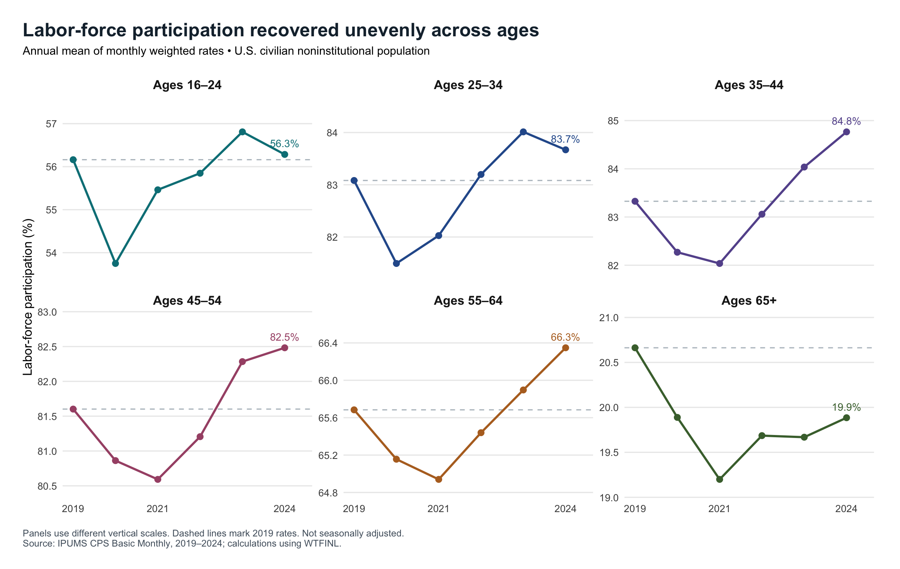
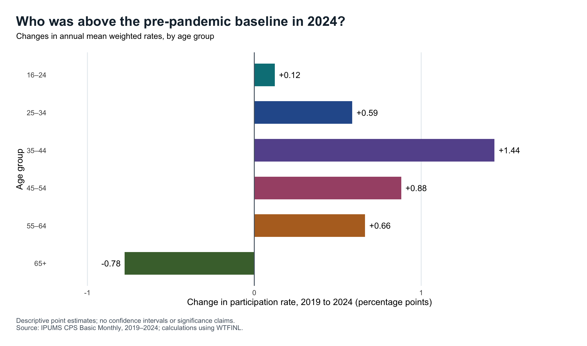

## Why an Older America Can Have a Lower Participation Rate Even as Many Age Groups Recover

Did Americans return to the labor force after the pandemic? The answer depends on which Americans we examine. Using IPUMS CPS microdata, I ask how labor-force participation changed across age groups between 2019 and 2024, and how much the changing age mix matters for the overall comparison. This distinction matters because a lower national participation rate can reflect both changes within age groups and a larger population share in groups that participate less.

## Measuring participation

I use all 72 Basic Monthly CPS samples from 2019–2024, restricting the analysis to civilians aged 16 and older with valid labor-force status and positive weights. The resulting sample contains 6,146,546 person-month observations, not that many distinct people. [LABFORCE](https://cps.ipums.org/cps-action/variables/LABFORCE) identifies people who are employed or unemployed and in the labor force; participation is therefore different from employment.

For each month and age group, I divide the sum of [WTFINL](https://cps.ipums.org/cps-action/variables/WTFINL) weights among labor-force participants by the sum among everyone in that group, then multiply by 100. Each annual estimate is the simple average of its twelve monthly rates. Weighting allows the sample to describe the U.S. civilian noninstitutional population. These estimates are not seasonally adjusted. They also need not equal published BLS figures, which use [composite weights](https://cps.ipums.org/cps-action/variables/COMPWT).


The core calculation in R is:

```r
monthly_by_age <- cps_clean[, .(
  participation_rate = 100 * sum(WTFINL * in_labor_force) / sum(WTFINL)
), by = .(YEAR, MONTH, age_group)]

annual_by_age <- monthly_by_age[, .(
  participation_rate = mean(participation_rate)
), by = .(YEAR, age_group)]
```

## A recovery that differed by age



Figure 1 shows a decline in every age group in 2020, followed by different recovery paths. By 2024, participation among people aged 35–44 reached 84.77%, compared with 83.33% in 2019. Participation among those aged 65 and older was 19.88%, still below its 20.66% starting point. Several groups reached their lowest annual rate in 2021, showing why a single pandemic-year comparison would miss part of the adjustment.

The panels use separate vertical scales to make changes visible. Their levels also differ greatly: participation among those aged 35–44 is much higher than among those aged 65+. That difference becomes important when interpreting the national average.



Figure 2 isolates the endpoint comparison. The largest increase among these groups was for ages 35–44, at 1.44 percentage points. Ages 45–54 and 55–64 rose by 0.88 and 0.66 points, respectively. Ages 16–24 were close to their starting level, increasing just 0.12 points. In contrast, the 65+ group declined by 0.78 points. These are differences in point estimates, not claims of statistical significance. Nor does the older group's decline establish that particular individuals retired: the people comprising an age group change over time.

## The age mix changes the national story


Overall participation fell from 63.40% in 2019 to 62.86% in 2024. How can that coexist with increases in five of six groups? Figure 3 shows that people aged 65+ grew from 20.40% to 22.23% of the population aged 16+. Giving more weight to a group with a low participation rate can lower the national average even when many group-specific rates rise.

To separate these patterns, I also calculate a standardized series using fourteen narrower age bands. Each month's age-specific rates are combined with the age shares from the same calendar month in 2019. With that age structure held fixed, the 2024 rate is 63.96%, or 0.56 points above 2019. The 1.10-point gap between standardized and actual participation summarizes the age-composition difference evaluated at 2024 participation rates.

This is an accounting exercise, not a causal estimate of aging or the pandemic. Changes within the narrow bands remain, and [pandemic-related nonresponse](https://cps.ipums.org/cps/covid19.shtml) may affect comparisons. The CPS also interviews some people repeatedly, so I do not treat all person-months as independent observations or report naive confidence intervals.

**The takeaway:** by 2024, participation had surpassed its 2019 level for several working-age groups, while the overall rate remained lower. Assessing labor-market recovery requires looking at both age-specific participation and the population's changing age composition.

---

*Data source: IPUMS CPS, University of Minnesota, [cps.ipums.org](https://cps.ipums.org/cps/), Basic Monthly samples, January 2019–December 2024; extract requested and downloaded through the IPUMS API on September 27, 2026. Underlying CPS data are provided by the U.S. Census Bureau and Bureau of Labor Statistics. All figures and numerical results are calculated from the microdata. See the accompanying README for extraction details and replication commands.*


[Analysis code and replication instructions](https://github.com/liyujing-byte/blogpost3_IPUMS-CPS).
