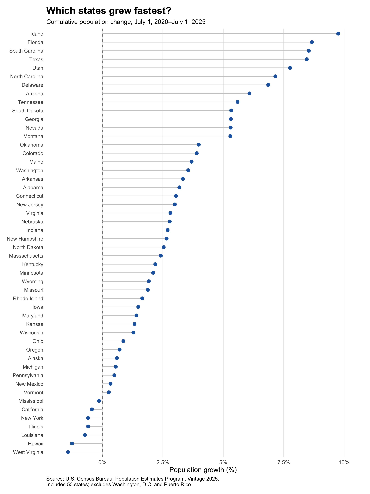
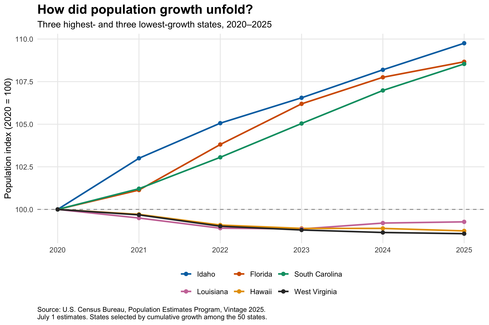
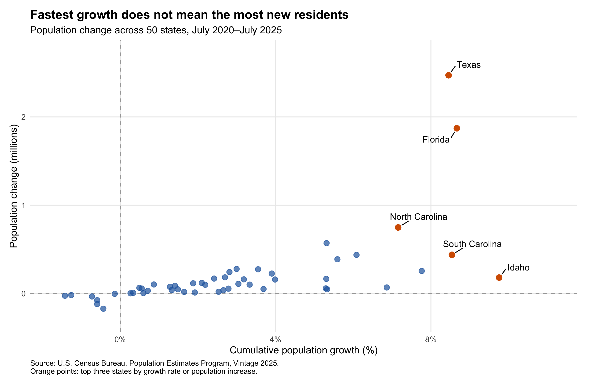

## One question, two measures of growth

Which U.S. states experienced the most population growth between 2020 and 2025? The answer depends on what we mean by “most.” Idaho had the highest percentage growth, but Texas added the largest number of residents.

This distinction matters when interpreting demographic change. Percentage growth measures the size of a population change relative to a state’s starting population. Absolute population change measures how many additional residents a state has. Both provide useful context for understanding potential demand for housing, transportation, and public services, although population alone does not determine those needs.

This post asks: **Which states grew fastest from 2020 to 2025, and how do rankings by percentage growth differ from rankings by additional residents?** Three visualizations examine the distribution of growth across states, the paths taken by selected states, and the relationship between relative growth and absolute population gains.

## Data and methods

I use the U.S. Census Bureau’s Population Estimates Program, specifically the **Vintage 2025** dataset, `NST-EST2025-ALLDATA.csv`. The analysis covers all 50 states and excludes Washington, D.C., Puerto Rico, and national or regional aggregates.

All population observations refer to **July 1** of the corresponding year. The comparison therefore runs from July 1, 2020, to July 1, 2025. I use the annual population estimate for 2020 rather than the April 1, 2020 estimates base, keeping the reference date consistent across years.

The R script downloads the [official CSV](https://www2.census.gov/programs-surveys/popest/datasets/2020-2025/state/totals/NST-EST2025-ALLDATA.csv) programmatically and saves the original file. It then filters the sample, checks that all 50 states are present without duplicate state codes, and verifies that the annual population values are numeric, nonmissing, and positive. The [Census variable documentation](https://www2.census.gov/programs-surveys/popest/technical-documentation/file-layouts/2020-2025/NST-EST2025-ALLDATA.pdf) provides the definitions and reference dates.

I calculate two main measures:

$$
\text{Population change}_s = P_{s,2025} - P_{s,2020}
$$

$$
\text{Cumulative growth rate}_s =
\frac{P_{s,2025} - P_{s,2020}}{P_{s,2020}}
\times 100
$$

Here, $P_{s,t}$ denotes the population of state $s$ in year $t$. These are **five-year cumulative growth rates**, not annual growth rates.

All years come from the same data vintage because Census estimates may be revised between releases. The code, data, figures, and reproduction instructions are available in the [analysis repository](https://github.com/liyujing-byte/blogpost4_data_visualization).

## 1. Idaho led in percentage growth

{#fig-growth fig-alt="Horizontal dot plot ranking all 50 states by cumulative population growth. Idaho ranks first, followed by Florida and South Carolina. Several states have negative growth." width=100%}

The first figure ranks all 50 states by cumulative percentage growth. Idaho grew by **9.76%**, followed by Florida at **8.67%** and South Carolina at **8.54%**. Texas ranked fourth, with growth of **8.45%**.

Growth varied considerably across states. While the leading states expanded substantially relative to their starting populations, several states ended the period with fewer residents than in 2020. West Virginia, Hawaii, and Louisiana occupied the bottom three positions in the growth-rate ranking.

The percentage measure makes states with different population sizes more comparable. It answers how large the change was relative to each state’s initial population. Without this adjustment, a comparison based only on additional residents would emphasize large states and could overlook substantial relative changes in smaller ones.

However, an endpoint ranking cannot show when those changes occurred. The next figure follows selected states through the intervening years.

## 2. Similar rankings can conceal different paths

{#fig-trends fig-alt="Line chart with all six states starting at 100 in 2020. Idaho, Florida, and South Carolina rise throughout the period. Louisiana declines initially and later partially recovers, while Hawaii and West Virginia finish below their starting levels." width=100%}

For this comparison, I select the three highest-growth states and the three lowest-growth states using the cumulative rates shown in Figure 1. This explicit selection rule focuses on contrasting cases rather than choosing states after inspecting their annual paths.

I normalize each state’s population to 100 in 2020:

$$
\text{Population index}_{s,t} =
\frac{P_{s,t}}{P_{s,2020}} \times 100
$$

An index of 105 means that population is 5% above its 2020 level. Giving every state the same starting value allows the figure to compare relative changes rather than population size.

Idaho, Florida, and South Carolina show sustained increases across the annual observations. Idaho’s population index reaches approximately **109.76** in 2025, consistent with its 9.76% cumulative growth.

The lower-growth states follow different paths. Louisiana’s population falls during the earlier years and then partially recovers, although it remains below its 2020 level in 2025. Hawaii and West Virginia also finish below their starting levels.

This adds information that the ranking alone cannot provide: a negative five-year change does not necessarily mean population declined in every year. Likewise, these six states are deliberately selected extremes, not a representative sample of all state trajectories.

## 3. Texas added the most residents

{#fig-comparison fig-alt="Scatterplot of percentage population growth against additional residents in millions. Idaho has the highest growth rate, while Texas has the largest population gain. Florida is high on both measures." width=100%}

The third figure compares percentage growth on the horizontal axis with additional residents, measured in millions, on the vertical axis. Each point represents one state. Orange points identify states ranking in the top three by either measure.

The contrast between Idaho and Texas illustrates the central result. Idaho’s population increased by **180,405**, placing it **14th** in absolute population gains despite ranking first in percentage growth. Texas added **2,471,926** residents—the largest increase—while ranking fourth in percentage growth.

Florida ranked second on both measures, adding **1,871,193** residents and growing by 8.67%. Thus, the two rankings can agree, but they do not have to.

The difference follows from a simple relationship:

$$
\text{Population change}_s =
P_{s,2020} \times
\frac{\text{Cumulative growth rate}_s}{100}
$$

Absolute gains depend on both the growth rate and the initial population. A larger state can add substantially more residents even when its percentage growth is lower.

The scatterplot is therefore a comparison of two related measures, not evidence that one variable causally affects the other. For interpreting demographic change, the useful question is which measure matches the issue being discussed. Relative growth describes expansion compared with the starting population; absolute gains describe the number of additional residents potentially requiring services.

## Limitations

This analysis describes population changes but does not identify their causes. Total population changes reflect births, deaths, migration, and estimation adjustments. The figures do not separate those components, so population growth should not be interpreted as migration alone.

The results also depend on the selected period and data vintage. A different starting year could produce different rankings, and future Census releases may revise the estimates. State-level totals additionally conceal differences among cities, suburbs, and rural areas within the same state.

Finally, the economic implications require further evidence. These figures do not establish that taxes, housing costs, employment opportunities, or other policies caused the observed changes. Nor do population totals alone measure pressure on infrastructure or public-service capacity.

## Conclusion

Between July 2020 and July 2025, **Idaho grew fastest in percentage terms, while Texas gained the most residents**. Florida ranked second on both measures.

The three figures show why population growth benefits from more than one perspective. Growth rates reveal relative expansion across differently sized states; annual indices show how that expansion or decline unfolded; and absolute gains reveal the scale of the change in residents.

When describing a state as “fast-growing,” it is therefore important to specify the measure. Percentage growth and population gains answer related but distinct questions.

## Data and reproducibility

- **Data:** [U.S. Census Bureau, Vintage 2025 population estimates](https://www2.census.gov/programs-surveys/popest/datasets/2020-2025/state/totals/).
- **Documentation:** [Variable definitions and reference dates](https://www2.census.gov/programs-surveys/popest/technical-documentation/file-layouts/2020-2025/NST-EST2025-ALLDATA.pdf).
- **Code and files:** [GitHub analysis repository](https://github.com/liyujing-byte/blogpost4_data_visualization).

The repository includes the original data, processed datasets, the complete R script, and all three figures. Its README explains how to reproduce the analysis using R, `ggplot2`, and `ggrepel`.